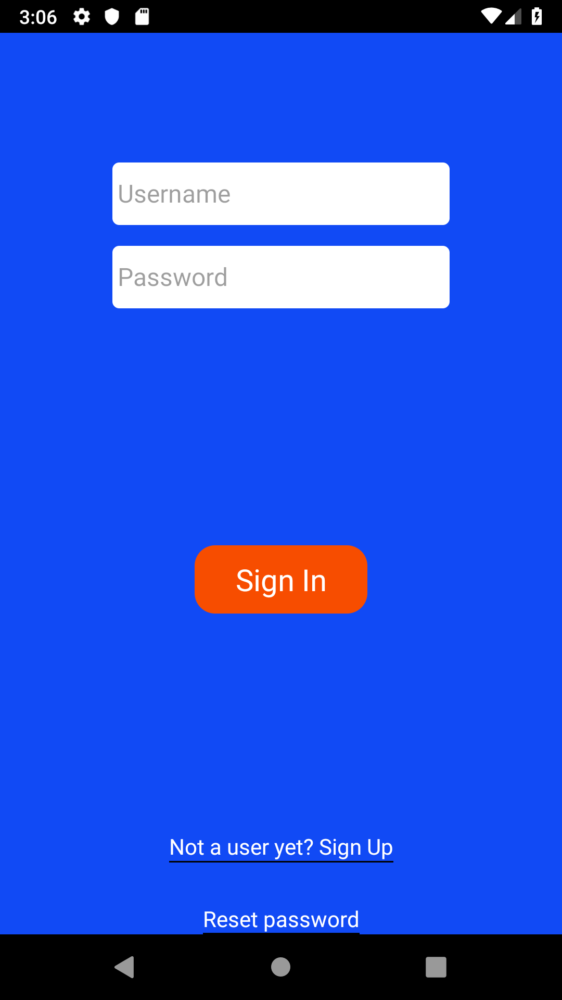
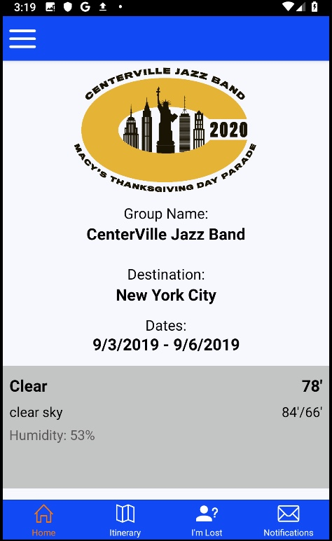
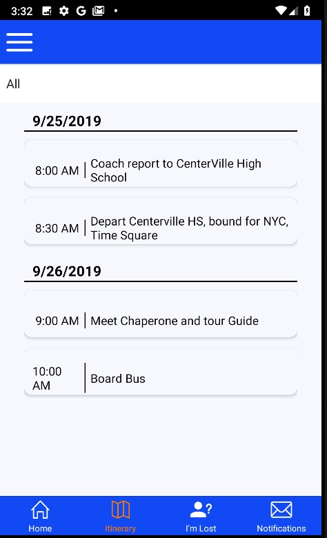
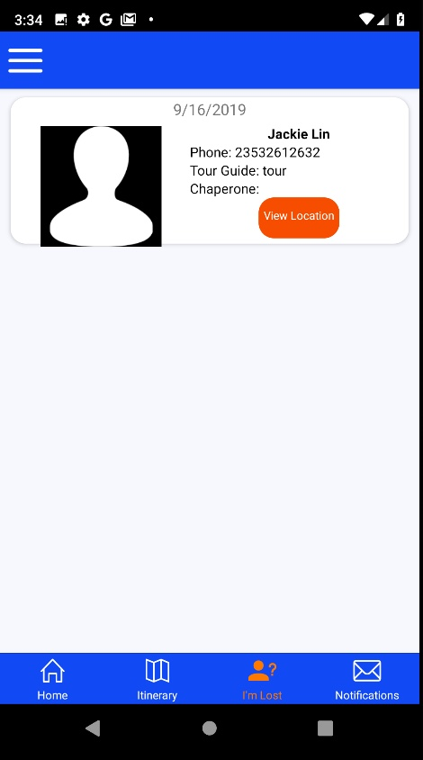
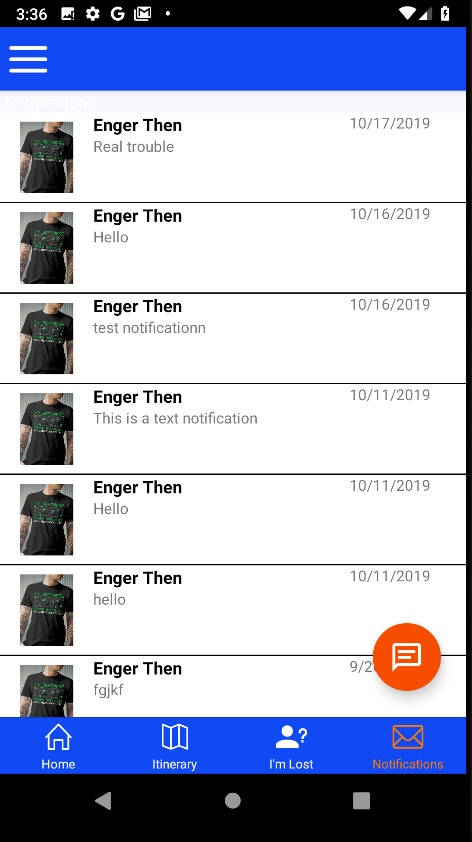
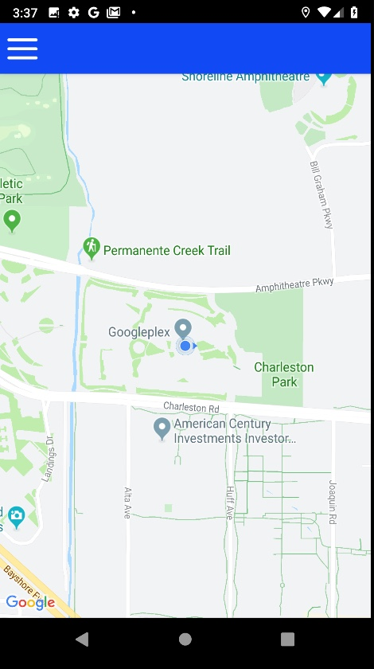

# TourApp

This is a mobile app that is meant for tour guides to manage their group easier. Thus, it is an app meant for communication.

## Getting Started
To run this app you for development and testing 'll need to get connected to Firebase. Get authorizing key to use their API. Once you have it just clone and run the app.

## Built with
React Native, ReduxJS, Firebase CMS.

## Autho
Enger L. Then

## More Previews
### Sign In

### Home Screen

### Itinerary Screen

### I'm Lost Screen

functionality that allows tour guides to find lost people throgh the app

### Notifications Screen

### Map screen

